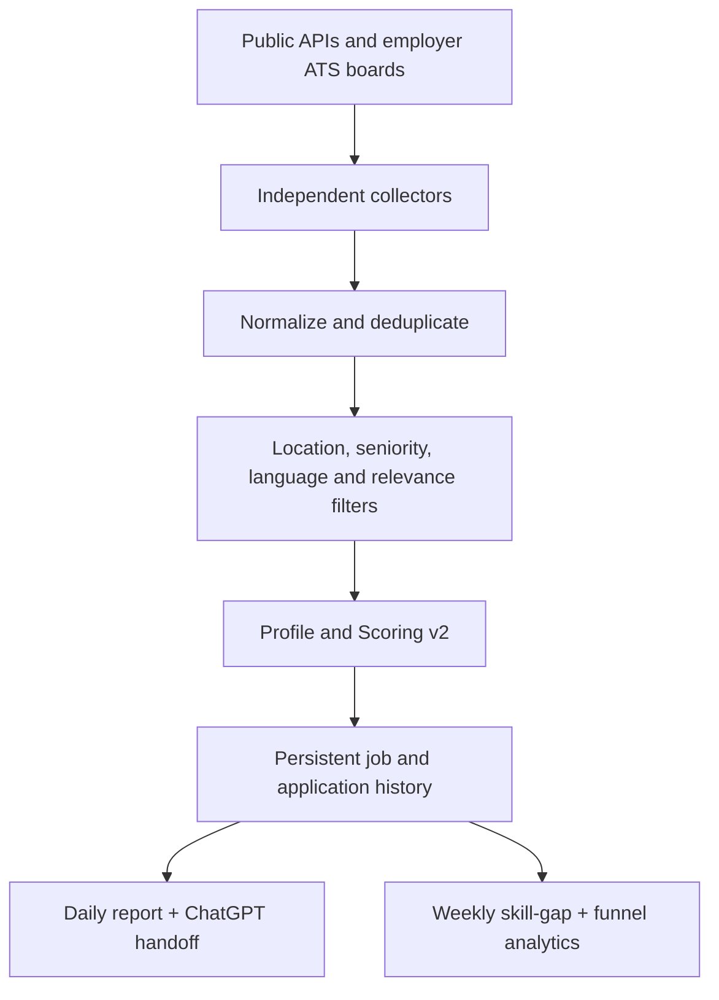

# Cybersecurity Job Radar

A zero-API-key, rule-based vacancy radar built around Bharatsingh Devda's verified profile. It discovers public cybersecurity jobs, normalizes and deduplicates them, rejects obvious mismatches, scores the remaining roles, preserves history, and creates compact daily and weekly reports.

The radar performs discovery and evidence-based triage. A human or ChatGPT still verifies the original vacancy and makes the final application decision. It never auto-applies and it never sends a CV to an employer.

## Version 2.1 quality safeguards

- Treats explicit fluent, excellent, very good, business-fluent, B2, C1, C2 and native German requirements as hard blockers for the current A2 profile.
- Keeps generic German requirements reviewable but caps them when the required level is unclear.
- Ignores German company names such as Deutsche Telekom when detecting language requirements.
- Rejects vacancies published more than 120 days ago; jobs older than 60 days or without a valid date receive conservative score caps.
- Understands `NICE-TO-HAVE` sections so optional technologies do not become mandatory gaps.
- Expands evidence checks for cloud, container, infrastructure, SOC, DLP, EDR, bug-bounty, GitHub-security and OT/ICS requirements.
- Caps roles with missing mandatory skills as stretch/review candidates instead of allowing inflated top-match scores.
- Merges same-company postings with identical or extremely similar descriptions, including title/location variants, while preferring Berlin when source quality is equal.
- Bounds duplicate comparisons so large employer boards cannot reintroduce the workflow timeout.
- Uses deterministic run dates in integration tests so posting-age tests do not expire over time.

## Version 2.0

- Profile and Scoring v2 based on verified CV evidence: 2.1 years of security consulting, 100+ web/API/mobile/thick-client assessments, 150+ high/critical findings, 50+ reports/SOPs, OWASP, Burp Suite, Fortify SAST/DAST, threat modelling, secure code review, Python automation, German A2 progressing toward B1, and a completed cybersecurity Master's.
- Separate `match`, `partial`, and `missing` skill evidence so exposure is not presented as production-depth expertise.
- Target families for Application Security, Product Security, Penetration Testing/VAPT, Security Testing, Vulnerability Management, Security Engineering, Cloud Security/DevSecOps, SOC/Detection, and IT Audit/GRC.
- Explicit seniority, required-experience, German-language, location, mandatory-skill, optional-skill, and posting-age analysis.
- Conservative caps for senior titles, experience above the profile, uncertain remote eligibility, and mandatory gaps.
- Strict title relevance and Germany/Europe-remote eligibility to suppress generic software, academic, physical-security, and region-locked jobs.
- Public Arbeitnow, Remotive, Greenhouse, Ashby, Lever, and Personio collection.
- Independent source/company failures, bounded parallel requests, timeouts, retries, and source-health output.
- Compact daily Markdown: five top matches and five review candidates; complete ranked data stays in JSON.
- A single private `reports/chatgpt_handoff.json` containing sanitized profile evidence, the top ten jobs, full descriptions, URLs, gaps, and analysis instructions.
- Weekly role-demand, skill-gap, score-band, and application-funnel analytics.
- Deterministic unit/integration tests with offline provider fixtures.
- Weekday GitHub Actions automation at 07:30 Europe/Berlin.

## Processing flow



One source or employer can fail without stopping successful collectors. A complete operational-source failure returns a non-zero exit code after diagnostic files are written.

## Repository layout

```text
cyber-job-radar/
├── .github/workflows/daily-jobs.yml
├── config/
│   ├── candidate_profile.json
│   ├── companies.json
│   ├── search_config.json
│   └── sources.json
├── data/
│   ├── applications.json
│   ├── job_history.json
│   ├── jobs.json
│   ├── seen_jobs.json
│   ├── source_health.json
│   └── weekly_analytics.json
├── reports/
│   ├── archive/
│   ├── chatgpt_handoff.json
│   ├── latest.json
│   ├── latest.md
│   └── weekly.md
├── src/
│   ├── collectors/
│   ├── analysis.py
│   ├── analytics.py
│   ├── classification.py
│   ├── eligibility.py
│   ├── filters.py
│   ├── main.py
│   ├── reporting.py
│   └── scoring.py
├── tests/
├── CHATGPT_ANALYSIS_PROMPT.md
├── VERSION_2_0_UPDATE.md
└── README.md
```

## Run locally on Windows

Requirements: Git and Python 3.12 or newer.

```powershell
Set-Location C:\JCR\Cybersecurity_Job_Radar_v1
py -3.12 -m venv .venv
.\.venv\Scripts\Activate.ps1
python -m pip install --disable-pip-version-check -r requirements.txt
python -m unittest discover -s tests -v
python -m src.main
Get-Content .\reports\latest.md
```

If PowerShell blocks activation, run this once in the current terminal:

```powershell
Set-ExecutionPolicy -Scope Process -ExecutionPolicy Bypass
```

Linux/Kali equivalents:

```bash
python3.12 -m venv .venv
source .venv/bin/activate
python -m pip install --disable-pip-version-check -r requirements.txt
python -m unittest discover -s tests -v
python -m src.main
```

Runtime collection uses only Python's standard library. Tests use offline provider-shaped fixtures and never overwrite the real repository data.

## GitHub Actions

The workflow runs Monday-Friday at 07:30 using `Europe/Berlin`, so daylight-saving time is handled by the scheduler. It can also be started from **Actions → Daily Cybersecurity Job Radar → Run workflow**.

The job checks out the repository, runs all tests, collects/scores vacancies, and commits only generated radar data and reports. No secrets or paid APIs are required. Standard public-repository GitHub-hosted runner usage is intended to keep operation at €0. If the repository is private, remain within the current GitHub Free included-minute allowance and do not enable paid/larger runners. Check GitHub billing settings after platform-plan changes.

## Profile and Scoring v2

Edit `config/candidate_profile.json` only when a fact changes truthfully:

- `match`: clear professional or substantial project evidence;
- `partial`: exposure, transferable experience, or limited project use;
- `missing`: not supported by the supplied profile.

The sanitized profile contains no phone, email, street address, photo, CV, identity document, or immigration document. Do not commit private documents; `.gitignore` blocks PDF and DOCX files.

| Category | Maximum |
| --- | ---: |
| Role-family alignment | 20 |
| Evidenced skills | 25 |
| Experience fit | 15 |
| Germany/Europe location eligibility | 15 |
| Language accessibility | 10 |
| Seniority fit | 10 |
| Education relevance | 5 |
| **Total** | **100** |

The raw score is followed by conservative caps. Examples: a senior title is capped, an explicit three-to-five-year requirement is capped progressively, mandatory German B1 is capped while the profile is A2, unsupported mandatory skills are capped, stale or undated postings are capped, and unclear remote eligibility cannot become a top match.

The main report excludes scores below 50. A score is not permission to claim a missing skill and is not a replacement for reading the original vacancy.

## Hard filters

The radar rejects:

- executive, director, head, manager, lead/architect, staff, and principal titles;
- internship/working-student-only jobs;
- explicit US, Canada, UK, India, Australia, and other non-target region restrictions;
- on-site or unclear hybrid jobs outside Germany;
- mandatory German B2/C1/C2/native requirements;
- explicit fluent, excellent, very good or business-fluent German requirements;
- postings older than the configured 120-day maximum;
- mandatory eight-plus years, citizenship, or active-clearance requirements;
- non-cyber titles that merely mention security in their descriptions;
- physical security, academic teaching, generic developer/data roles, and similar false positives.

Germany always wins when explicitly present. Europe/EMEA remote jobs are accepted. A location explicitly restricted outside the target region wins over generic “global company” wording in the description.

## Employer ATS configuration

`config/companies.json` holds employer identifiers. Invalid types, missing identifiers, duplicate identifiers, and unsupported ATS sections fail before network collection.

### Greenhouse

For `https://boards.greenhouse.io/example`:

```json
{"name": "Example GmbH", "board": "example", "priority": false, "enabled": true}
```

### Ashby

For `https://jobs.ashbyhq.com/example`:

```json
{"name": "Example GmbH", "board": "example", "priority": false, "enabled": true}
```

### Lever

For `https://jobs.lever.co/example`, use `global`; for an EU-hosted API tenant use `eu`:

```json
{"name": "Example GmbH", "site": "example", "region": "global", "priority": false, "enabled": true}
```

### Personio

For `https://example.jobs.personio.de`:

```json
{"name": "Example GmbH", "account": "example", "language": "en", "priority": false, "enabled": true}
```

Never guess identifiers. Open the employer's genuine careers page and copy the tenant/board token from its ATS URL. A migrated or invalid board is recorded as a company-level source-health error while other employers continue. Priority-company metadata is a review tie-breaker; it does not inflate fit scores.

## Generated outputs

- `reports/latest.md`: deliberately compact daily reading queue.
- `reports/latest.json`: up to 30 ranked jobs with structured scoring evidence.
- `reports/chatgpt_handoff.json`: the only file needed for a private ChatGPT vacancy review.
- `reports/weekly.md`: human-readable weekly demand, gap, and funnel summary.
- `data/jobs.json`: persistent normalized job database with full descriptions.
- `data/source_health.json`: provider and employer success/error details.
- `data/weekly_analytics.json`: up to 104 weekly snapshots.

For ChatGPT, upload only `reports/chatgpt_handoff.json` and say:

```text
Analyze the supplied Cybersecurity Job Radar handoff. Verify each full vacancy against the
sanitized evidence, then recommend APPLY FIRST, APPLY, REVIEW, STRETCH, or SKIP. Identify
mandatory and optional gaps, location risk, truthful CV tailoring, and interview preparation.
Never invent skills, certifications, language level, or production experience.
```

## Application tracking and funnel analytics

Copy a `job_key` from `reports/latest.json` or `data/jobs.json` into `data/applications.json`:

```json
{
  "0123456789abcdef0123": {
    "status": "APPLIED",
    "applied_date": "2026-08-15",
    "cv_version": "security-v4",
    "cover_letter_used": true,
    "response_date": null,
    "interview_date": null,
    "final_result": null,
    "notes": "Applied on employer career page"
  }
}
```

Suggested statuses: `REVIEW`, `SAVE`, `APPLIED`, `RECRUITER CONTACT`, `PHONE SCREEN`, `INTERVIEW`, `TECHNICAL INTERVIEW`, `FINAL INTERVIEW`, `OFFER`, `REJECTED`, `GHOSTED`, `WITHDRAWN`, and `SKIPPED`.

Already-applied, interviewed, rejected, ghosted, withdrawn, offered, and skipped jobs stay in storage but are excluded from the daily application queue. Update the application file after each action; otherwise weekly funnel rates remain zero.

## Safe update and Git commands

For Scoring v2.1, follow `VERSION_2_1_UPDATE.md`. The update must preserve `data/jobs.json`, `data/seen_jobs.json`, `data/job_history.json`, `data/applications.json`, and existing report archives.

After copying the v2 files:

```powershell
python -m unittest discover -s tests -v
git status
git add config src tests README.md VERSION_2_1_UPDATE.md
git commit -m "fix: improve language age gap and duplicate scoring"
git pull --rebase origin main
git push
```

Then run the workflow manually on GitHub. The workflow creates and commits the new handoff and weekly outputs without mixing a local live-data refresh into the code-update commit.

Do not use `git add .` until `git status` confirms that no CV/PDF/private file is present.

## Debugging checklist

- Tests fail: do not run or push the live workflow until all tests pass.
- One source fails: inspect `data/source_health.json`; successful providers should still report.
- ATS is idle: no enabled companies are configured for that ATS.
- One company fails: verify its current public ATS identifier; the remaining companies continue.
- Job count suddenly collapses: compare source health before changing scoring rules.
- Bad job appears: inspect `location_analysis`, `seniority_analysis`, `role_family`, and `rejection_summary`, then add a regression test before changing the rule.
- Score looks wrong: inspect `raw_score`, `score_cap`, `score_breakdown`, `mandatory_gaps`, and `warnings`.
- Workflow exceeds time: keep bounded workers, remove invalid employer boards, and leave the workflow timeout at 30 minutes.
- Git push is rejected: run `git status`, commit or stash intentional changes, then `git pull --rebase origin main` and `git push`.

## Cost and safety constraints

- No OpenAI API, paid job API, database, server, or email service is required.
- Only documented/public vacancy feeds are queried; the system does not bypass logins, CAPTCHAs, or access controls.
- The repository stores professional matching evidence, not the private CV.
- Review the source list periodically because employers can change ATS providers or public identifiers.
