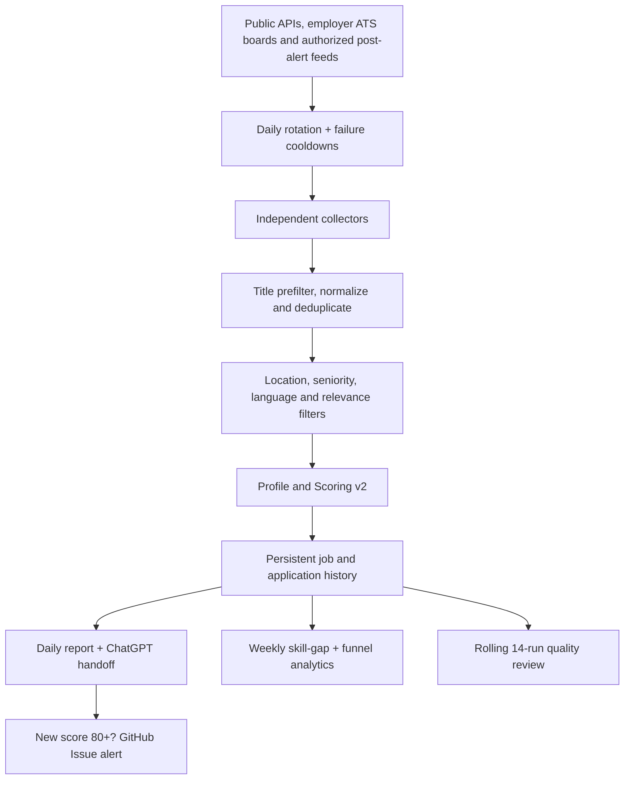

# Cybersecurity Job Radar

A zero-API-key, rule-based vacancy radar built around Bharatsingh Devda's verified profile. It discovers public cybersecurity jobs, normalizes and deduplicates them, rejects obvious mismatches, scores the remaining roles, preserves history, and creates compact daily and weekly reports.

The radar performs discovery and evidence-based triage. A human or ChatGPT still verifies the original vacancy and makes the final application decision. It never auto-applies and it never sends a CV to an employer.

## Version 2.4 LinkedIn leads, 50-job report and automatic tracker updates

- Adds a compliant LinkedIn-post lead collector that consumes user-authorized RSS/Atom alerts but never requests LinkedIn, signs in, stores cookies, scrapes profiles, or bypasses access controls.
- Keeps only public LinkedIn post URLs whose alert metadata contains both a target cybersecurity role and clear hiring intent.
- Treats each post as an unverified lead and caps it below automatic alert level until the employer, complete vacancy, English requirement, Germany eligibility and official application link are verified.
- Selects the daily reading queue from the cumulative active database and displays up to 50 ranked jobs in `reports/latest.md`.
- Never pads the Markdown report with rejected or irrelevant roles when fewer than 50 active matches exist.
- Adds **Actions → Update Application Tracker**, a validated form that updates `data/applications.json` and `reports/application_tracker.csv` and commits them automatically.
- Shows the required `job_key` and tracker-form link beneath every job in `reports/latest.md`.
- Expands the deterministic offline suite to 63 passing tests.

## Version 2.3 selective alerts and quality calibration

- Creates a GitHub Issue only when a newly discovered, unapplied vacancy scores at least 80: `APPLY FIRST` at 85+ or a strong `APPLY` at 80-84.
- Uses the repository's built-in `GITHUB_TOKEN`; no Telegram bot, email password, paid service, or additional secret is required.
- Uses a deterministic alert title and checks existing issues before creation, preventing duplicate alerts after a workflow retry.
- Assigns the alert Issue to the repository owner and keeps radar collection successful if GitHub Issue creation is unavailable.
- Adds explicit suitable/false-positive feedback and missed-vacancy logging instead of pretending those metrics can be inferred automatically.
- Generates a rolling `reports/quality_review.md` from the latest 14 completed daily runs.
- Measures relevant/new jobs, review coverage, false positives, missed vacancies, duplicates, source failures, workflow duration, applications, interviews, and score-band outcomes.
- Compares score-component averages only when both interview and negative outcomes exist; it never changes scoring weights automatically.
- Expands the deterministic suite to 58 passing tests.

## Version 2.2 production operations

- Replaces the all-employers-every-day pattern with five deterministic weekday batches. Priority employers are checked every weekday; together, Monday-Friday cover every enabled non-priority employer.
- Runs a complete employer-watchlist scan on Sunday while keeping Arbeitnow and Remotive in every run.
- Uses separate eight-second, single-attempt ATS requests so a slow employer cannot consume the workflow budget.
- Maintains `data/company_health.json`: successful checks recover immediately, transient failures back off exponentially, and HTTP 404/410 identifiers are suppressed for 30 days before a safe retry.
- Writes `reports/company_health.md` with coverage, verified security-hiring employers and suppressed identifiers.
- Applies the strict cybersecurity-title rule before normalization and deduplication. A measured weekday live run skipped 5,993 irrelevant titles and processed 211 security candidates from 6,204 raw postings in 132 seconds.
- Adds public Recruitee collection, initially covering Cygrid's Berlin cybersecurity feed and the German DrAnsay healthtech feed.
- Expands the validated watchlist to 200 employers, including Berlin startup/scale-up metadata and 14 employers with security hiring verified on 2026-08-16.
- Adds a validated application-tracker command, CSV export, recommendation/CV-version funnel cohorts, and rejection/interview outcome dates.
- Adds regression coverage for rotation, cooldown recovery, startup metadata, Recruitee, application validation and export. The suite contains 54 passing tests.

## Version 2.1 quality safeguards

- Treats explicit fluent, excellent, very good, business-fluent, B2, C1, C2 and native German requirements as hard blockers for the current A2 profile.
- Keeps generic German requirements reviewable but caps them when the required level is unclear.
- Ignores German company names such as Deutsche Telekom when detecting language requirements.
- Rejects vacancies published more than 120 days ago; jobs older than 60 days or without a valid date receive conservative score caps.
- Understands `NICE-TO-HAVE` sections so optional technologies do not become mandatory gaps.
- Expands evidence checks for cloud, container, infrastructure, SOC, DLP, EDR, bug-bounty, GitHub-security and OT/ICS requirements.
- Caps roles with missing mandatory skills as stretch/review candidates instead of allowing inflated top-match scores.
- Merges same-company postings with identical or extremely similar descriptions, including title/location variants, while preferring Berlin when source quality is equal.
- Bounds duplicate comparisons so large employer boards cannot reintroduce the workflow timeout.
- Uses deterministic run dates in integration tests so posting-age tests do not expire over time.

## Version 2.0

- Profile and Scoring v2 based on verified CV evidence: 2.1 years of security consulting, 100+ web/API/mobile/thick-client assessments, 150+ high/critical findings, 50+ reports/SOPs, OWASP, Burp Suite, Fortify SAST/DAST, threat modelling, secure code review, Python automation, German A2 progressing toward B1, and a completed cybersecurity Master's.
- Separate `match`, `partial`, and `missing` skill evidence so exposure is not presented as production-depth expertise.
- Target families for Application Security, Product Security, Penetration Testing/VAPT, Security Testing, Vulnerability Management, Security Engineering, Cloud Security/DevSecOps, SOC/Detection, and IT Audit/GRC.
- Explicit seniority, required-experience, German-language, location, mandatory-skill, optional-skill, and posting-age analysis.
- Conservative caps for senior titles, experience above the profile, uncertain remote eligibility, and mandatory gaps.
- Strict title relevance and Germany/Europe-remote eligibility to suppress generic software, academic, physical-security, and region-locked jobs.
- Public Arbeitnow, Remotive, Greenhouse, Ashby, Lever, Personio, and Recruitee collection.
- Independent source/company failures, bounded parallel requests, timeouts, retries, and source-health output.
- Daily Markdown containing up to 50 active ranked jobs; complete structured data stays in JSON.
- A single private `reports/chatgpt_handoff.json` containing sanitized profile evidence, the top ten jobs, full descriptions, URLs, gaps, and analysis instructions.
- Weekly role-demand, skill-gap, score-band, and application-funnel analytics.
- Deterministic unit/integration tests with offline provider fixtures.
- Weekday GitHub Actions automation at 07:30 Europe/Berlin.

## Processing flow



One source or employer can fail without stopping successful collectors. A complete operational-source failure returns a non-zero exit code after diagnostic files are written.

## Repository layout

```text
cyber-job-radar/
├── .github/workflows/daily-jobs.yml
├── .github/workflows/update-application.yml
├── config/
│   ├── candidate_profile.json
│   ├── companies.json
│   ├── search_config.json
│   └── sources.json
├── data/
│   ├── applications.json
│   ├── company_health.json
│   ├── job_history.json
│   ├── jobs.json
│   ├── quality_feedback.json
│   ├── seen_jobs.json
│   ├── source_health.json
│   └── weekly_analytics.json
├── reports/
│   ├── archive/
│   ├── application_tracker.csv
│   ├── chatgpt_handoff.json
│   ├── company_health.md
│   ├── job_alert.json
│   ├── job_alert.md
│   ├── latest.json
│   ├── latest.md
│   ├── quality_review.json
│   ├── quality_review.md
│   └── weekly.md
├── src/
│   ├── collectors/
│   ├── analysis.py
│   ├── analytics.py
│   ├── classification.py
│   ├── eligibility.py
│   ├── filters.py
│   ├── main.py
│   ├── notifications.py
│   ├── quality_review.py
│   ├── reporting.py
│   └── scoring.py
├── tests/
├── CHATGPT_ANALYSIS_PROMPT.md
├── VERSION_2_3_UPDATE.md
├── VERSION_2_4_UPDATE.md
├── VERSION_2_2_UPDATE.md
└── README.md
```

## Run locally on Windows

Requirements: Git and Python 3.12 or newer.

```powershell
Set-Location C:\JCR\Cybersecurity_Job_Radar_v1
py -3.12 -m venv .venv
.\.venv\Scripts\Activate.ps1
python -m pip install --disable-pip-version-check -r requirements.txt
python -m unittest discover -s tests -v
python -m src.main
Get-Content .\reports\latest.md
```

If PowerShell blocks activation, run this once in the current terminal:

```powershell
Set-ExecutionPolicy -Scope Process -ExecutionPolicy Bypass
```

Linux/Kali equivalents:

```bash
python3.12 -m venv .venv
source .venv/bin/activate
python -m pip install --disable-pip-version-check -r requirements.txt
python -m unittest discover -s tests -v
python -m src.main
```

Runtime collection uses only Python's standard library. Tests use offline provider-shaped fixtures and never overwrite the real repository data.

## GitHub Actions

The workflow runs Monday-Friday at 07:30 using `Europe/Berlin`. Those runs use one rotating employer batch plus every priority employer. A full watchlist run happens Sunday at 08:00. It can also be started from **Actions → Daily Cybersecurity Job Radar → Run workflow**, where `daily` or `full` can be selected.

The job checks out the repository, runs all tests, collects/scores vacancies, and commits only generated radar data and reports. Core ATS collection needs no secret. LinkedIn post discovery uses one optional secret containing feed URLs. Standard public-repository GitHub-hosted runner usage is intended to keep operation at €0. If the repository is private, remain within the current GitHub Free included-minute allowance and do not enable paid/larger runners. Check GitHub billing settings after platform-plan changes.

### LinkedIn public-post leads without scraping

LinkedIn does not provide a free general API for searching every member's posts. Its rules also prohibit unauthorized crawlers, scripts and bots. The radar therefore does **not** access LinkedIn automatically. Instead, it consumes RSS/Atom alerts that you created and that contain public LinkedIn post links. Coverage depends on what the alert provider indexes; no €0 compliant method can guarantee every LinkedIn post.

One-time setup:

1. Open [Google Alerts](https://www.google.com/alerts) while signed in.
2. Create separate alerts rather than one complicated query. Suggested searches:

```text
site:linkedin.com/posts "application security" hiring Germany
site:linkedin.com/posts "product security" hiring Germany
site:linkedin.com/posts "penetration tester" hiring Germany
site:linkedin.com/posts "security tester" hiring Germany
site:linkedin.com/posts "security engineer" hiring Berlin
site:linkedin.com/posts cybersecurity hiring "remote Germany"
```

3. For each alert choose English, Germany, all results and RSS delivery. Copy the resulting RSS URL.
4. In GitHub open **Settings → Secrets and variables → Actions → New repository secret**.
5. Name it `LINKEDIN_POST_FEEDS_JSON` and store the URLs as a JSON array:

```json
[
  "https://www.google.com/alerts/feeds/REPLACE_WITH_YOUR_FIRST_FEED",
  "https://www.google.com/alerts/feeds/REPLACE_WITH_YOUR_SECOND_FEED"
]
```

Do not commit private feed URLs to `config/sources.json`. The workflow reads the secret at runtime. With no secret configured, `linkedin_posts` is safely reported as `idle` and every other source continues.

The collector stores only feed-provided lead metadata and the public post URL. It does not fetch the post. Each lead is labelled and capped at 69 until a person verifies the complete official vacancy.

### Free strong-match notifications

The workflow has minimum `contents: write` and `issues: write` permissions. When at least one genuinely new job scores 80+, it creates one `job-alert` Issue containing all qualifying jobs for that run. Seen-before, already-applied, `REVIEW`, and `STRETCH` vacancies do not trigger an alert.

After installing v2.3:

1. Open the repository's **Settings → General → Features** and confirm **Issues** is enabled.
2. Open **Watch → Custom** on the repository and enable **Issues** so GitHub sends your selected web/email notifications.
3. Run the workflow once using `daily`. A run without a new score-80+ job correctly creates no Issue.

The Issue step uses GitHub CLI with the built-in token and a Markdown body file. It never interpolates vacancy descriptions into shell commands. Issue creation is non-blocking: a disabled Issues feature or temporary GitHub permission problem produces a workflow warning but does not discard the radar reports.

## Profile and Scoring v2

Edit `config/candidate_profile.json` only when a fact changes truthfully:

- `match`: clear professional or substantial project evidence;
- `partial`: exposure, transferable experience, or limited project use;
- `missing`: not supported by the supplied profile.

The sanitized profile contains no phone, email, street address, photo, CV, identity document, or immigration document. Do not commit private documents; `.gitignore` blocks PDF and DOCX files.

| Category | Maximum |
| --- | ---: |
| Role-family alignment | 20 |
| Evidenced skills | 25 |
| Experience fit | 15 |
| Germany/Europe location eligibility | 15 |
| Language accessibility | 10 |
| Seniority fit | 10 |
| Education relevance | 5 |
| **Total** | **100** |

The raw score is followed by conservative caps. Examples: a senior title is capped, an explicit three-to-five-year requirement is capped progressively, mandatory German B1 is capped while the profile is A2, unsupported mandatory skills are capped, stale or undated postings are capped, and unclear remote eligibility cannot become a top match.

The main report excludes scores below 50. A score is not permission to claim a missing skill and is not a replacement for reading the original vacancy.

## Hard filters

The radar rejects:

- executive, director, head, manager, lead/architect, staff, and principal titles;
- internship/working-student-only jobs;
- explicit US, Canada, UK, India, Australia, and other non-target region restrictions;
- on-site or unclear hybrid jobs outside Germany;
- mandatory German B2/C1/C2/native requirements;
- explicit fluent, excellent, very good or business-fluent German requirements;
- postings older than the configured 120-day maximum;
- mandatory eight-plus years, citizenship, or active-clearance requirements;
- non-cyber titles that merely mention security in their descriptions;
- physical security, academic teaching, generic developer/data roles, and similar false positives.

Germany always wins when explicitly present. Europe/EMEA remote jobs are accepted. A location explicitly restricted outside the target region wins over generic “global company” wording in the description.

## Employer ATS configuration

`config/companies.json` holds employer identifiers. Invalid types, missing identifiers, duplicate identifiers, and unsupported ATS sections fail before network collection.

### Greenhouse

For `https://boards.greenhouse.io/example`:

```json
{"name": "Example GmbH", "board": "example", "priority": false, "enabled": true}
```

### Ashby

For `https://jobs.ashbyhq.com/example`:

```json
{"name": "Example GmbH", "board": "example", "priority": false, "enabled": true}
```

### Lever

For `https://jobs.lever.co/example`, use `global`; for an EU-hosted API tenant use `eu`:

```json
{"name": "Example GmbH", "site": "example", "region": "global", "priority": false, "enabled": true}
```

### Personio

For `https://example.jobs.personio.de`:

```json
{"name": "Example GmbH", "account": "example", "language": "en", "priority": false, "enabled": true}
```

### Recruitee

For `https://example.recruitee.com`:

```json
{"name": "Example GmbH", "subdomain": "example", "priority": false, "enabled": true}
```

Optional evidence fields are validated and shown in the company-health report:

```json
{
  "category": "berlin_cybersecurity_startup",
  "current_security_hiring": true,
  "security_hiring_verified_at": "2026-08-16",
  "security_roles_verified": ["Application Security Engineer"]
}
```

Never guess identifiers. Open the employer's genuine careers page and copy the tenant/board token from its ATS URL. A migrated or invalid board is recorded as a company-level source-health error while other employers continue. Priority-company metadata is a review tie-breaker; it does not inflate fit scores.

## Generated outputs

- `reports/latest.md`: up to 50 active ranked jobs with direct links, gaps, job keys and tracker links.
- `reports/latest.json`: up to 50 active ranked jobs with structured scoring evidence.
- `reports/chatgpt_handoff.json`: the only file needed for a private ChatGPT vacancy review.
- `reports/weekly.md`: human-readable weekly demand, gap, and funnel summary.
- `data/jobs.json`: persistent normalized job database with full descriptions.
- `data/source_health.json`: provider and employer success/error details.
- `data/company_health.json`: persistent per-employer success, failure, cooldown and retry state.
- `data/weekly_analytics.json`: up to 104 weekly snapshots.
- `reports/company_health.md`: human-readable scan coverage and employer problems.
- `reports/application_tracker.csv`: spreadsheet-friendly application records.
- `reports/job_alert.json` and `reports/job_alert.md`: deterministic payload for a new strong-match GitHub Issue.
- `data/quality_feedback.json`: manual suitable/false-positive and missed-vacancy evidence.
- `reports/quality_review.json` and `reports/quality_review.md`: rolling 14-daily-run quality and outcome review.

For ChatGPT, upload only `reports/chatgpt_handoff.json` and say:

```text
Analyze the supplied Cybersecurity Job Radar handoff. Verify each full vacancy against the
sanitized evidence, then recommend APPLY FIRST, APPLY, REVIEW, STRETCH, or SKIP. Identify
mandatory and optional gaps, location risk, truthful CV tailoring, and interview preparation.
Never invent skills, certifications, language level, or production experience.
```

## Application tracking and funnel analytics

The easiest method requires no local editing, PowerShell, Git commit, pull or push:

1. Open `reports/latest.md` on GitHub.
2. Copy the `job_key` shown below the vacancy.
3. Click **Open the automatic update form**, or open **Actions → Update Application Tracker → Run workflow**.
4. Paste the job key, choose the current status and optionally enter dates, CV version, cover-letter choice and a short note.
5. Run the workflow. It validates the record, updates both JSON and CSV, runs tracker tests, commits and pushes automatically.

The status in `reports/application_tracker.csv` changes immediately. The job's status inside `reports/latest.md` is refreshed during the next radar run. The form cannot infer whether you truly submitted an application; retaining that one truthful selection prevents incorrect funnel analytics.

The local command remains available as a fallback. Copy a `job_key` from `reports/latest.md`, `reports/latest.json` or `data/jobs.json`:

```powershell
python -m src.application_tracker set `
  --job-key "PASTE_JOB_KEY" `
  --status "APPLIED" `
  --cv-version "appsec-v5" `
  --cover-letter-used yes `
  --notes "Applied through the employer career page"
```

The command fills company, position, score, recommendation, URL and application date from the stored job. Update later stages with the same `job_key`:

```powershell
python -m src.application_tracker set `
  --job-key "PASTE_JOB_KEY" `
  --status "TECHNICAL INTERVIEW" `
  --response-date "2026-08-20" `
  --interview-date "2026-08-25" `
  --interview-stage "Technical interview" `
  --notes "Prepare API testing strategy and threat-modelling examples"

python -m src.application_tracker list
python -m src.application_tracker export
```

For a vacancy not present in the radar database, also supply `--company` and `--position`. Dates must use `YYYY-MM-DD`; scores must be between 0 and 100; unsupported statuses fail before the file is written.

Suggested statuses: `REVIEW`, `SAVE`, `APPLIED`, `RECRUITER CONTACT`, `PHONE SCREEN`, `INTERVIEW`, `TECHNICAL INTERVIEW`, `FINAL INTERVIEW`, `OFFER`, `REJECTED`, `GHOSTED`, `WITHDRAWN`, and `SKIPPED`.

Already-applied, interviewed, rejected, ghosted, withdrawn, offered, and skipped jobs stay in storage but are excluded from the daily application queue. Update the form after each application or recruiter event; otherwise weekly funnel rates remain zero.

Weekly analytics calculate response, interview and offer rates in total and separately by radar recommendation and CV version. This shows whether stronger radar scores and particular truthful CV versions actually produce better outcomes.

If the GitHub repository is public, application records are also public. Keep notes professional and non-sensitive, never store recruiter contact details, and make the repository private if the application history should remain confidential.

## Fourteen-run quality review

Automatic counts cannot determine whether a job was truly suitable. Review radar jobs and record the result using their `job_key`:

```powershell
python -m src.quality_review mark `
  --job-key "PASTE_JOB_KEY" `
  --verdict suitable `
  --notes "Mandatory requirements and Germany location verified"

python -m src.quality_review mark `
  --job-key "PASTE_JOB_KEY" `
  --verdict false-positive `
  --notes "Title looked relevant but the work is physical security"
```

If you find a suitable vacancy elsewhere that the radar missed:

```powershell
python -m src.quality_review missed `
  --company "Example GmbH" `
  --position "Penetration Tester" `
  --url "https://example.com/careers/job" `
  --found-date "2026-08-17" `
  --reason "Employer/source not covered"
```

Review or regenerate the evidence at any time:

```powershell
python -m src.quality_review list
python -m src.quality_review report
Get-Content .\reports\quality_review.md
```

The baseline starts with the first v2.3 run; older preserved v2.2 history is not counted. After 14 calendar days with completed `daily` runs, the report changes from `COLLECTING BASELINE` to `READY FOR EVIDENCE REVIEW`. Only the latest rerun from each day is counted; Sunday `full` runs are excluded so repeated manual runs cannot fake a two-week baseline. A false-positive rate is labelled unreliable until at least five jobs have been manually reviewed. Score calibration also remains blocked until at least six usable outcomes include both interviews and rejection/ghosting results.

Do not change weights merely because 14 days elapsed. A change requires actual evidence, inspection of the underlying jobs, a small controlled adjustment that keeps the total at 100, and a regression test. Quality notes are committed by the workflow; keep them non-sensitive if the repository is public.

## Safe update and Git commands

For LinkedIn Leads, 50-Job Reporting and Automatic Tracker v2.4, follow `VERSION_2_4_UPDATE.md`. The update must preserve `data/jobs.json`, `data/seen_jobs.json`, `data/job_history.json`, `data/applications.json`, `data/company_health.json`, `data/quality_feedback.json`, and existing report archives.

After copying the v2 files:

```powershell
python -m unittest discover -s tests -v
git status
git add .github config src tests README.md VERSION_2_4_UPDATE.md
git commit -m "feat: add LinkedIn leads, 50-job report and automatic tracker"
git pull --rebase origin main
git push
```

Then run the workflow manually on GitHub. The workflow creates and commits the new handoff and weekly outputs without mixing a local live-data refresh into the code-update commit.

Do not use `git add .` until `git status` confirms that no CV/PDF/private file is present.

## Debugging checklist

- Tests fail: do not run or push the live workflow until all tests pass.
- One source fails: inspect `data/source_health.json`; successful providers should still report.
- ATS is idle: no enabled companies are configured for that ATS.
- LinkedIn Posts is idle: configure the optional `LINKEDIN_POST_FEEDS_JSON` repository secret; other sources continue normally.
- LinkedIn feed returns zero leads: confirm the feed contains public `/posts/`, `/feed/update/`, or `/pulse/` URLs and hiring/security terms. The radar intentionally rejects generic posts.
- Tracker form fails: copy the exact job key from `reports/latest.md`, use `YYYY-MM-DD` dates, and check whether another radar workflow is still running.
- One company fails: verify its current public ATS identifier; the remaining companies continue.
- Job count suddenly collapses: compare source health before changing scoring rules.
- Bad job appears: inspect `location_analysis`, `seniority_analysis`, `role_family`, and `rejection_summary`, then add a regression test before changing the rule.
- Score looks wrong: inspect `raw_score`, `score_cap`, `score_breakdown`, `mandatory_gaps`, and `warnings`.
- No alert Issue: confirm the job is `NEW`, scores at least 80, Issues is enabled, and the workflow has `issues: write`; a normal run with no qualifying job should not create an Issue.
- Quality report is incomplete: mark reviewed jobs, log missed vacancies, and update application/interview dates; the radar cannot infer these facts.
- Workflow approaches 30 minutes: confirm the run uses `daily`, inspect `reports/company_health.md`, and keep the title prefilter and eight-second ATS timeout enabled. Use `full` only for the Sunday/manual audit.
- Git push is rejected: run `git status`, commit or stash intentional changes, then `git pull --rebase origin main` and `git push`.

## Cost and safety constraints

- No OpenAI API, paid job API, database, server, or email service is required.
- Only documented/public vacancy feeds are queried; the system does not bypass logins, CAPTCHAs, or access controls.
- The repository stores professional matching evidence, not the private CV.
- Review the source list periodically because employers can change ATS providers or public identifiers.
