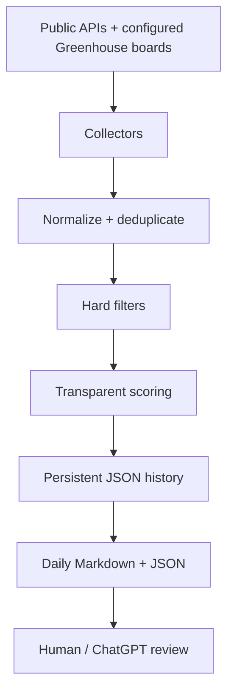

# Cybersecurity Job Radar

A free, rule-based job discovery and matching system for a Berlin-based cybersecurity candidate. It collects public vacancies, normalizes and deduplicates them, rejects clearly unsuitable roles, scores the remaining jobs against a truthful professional profile, and produces a compact daily decision queue.

The crawler performs **discovery + first filtering**. ChatGPT or a human performs the final vacancy review, CV tailoring, and APPLY / REVIEW / SKIP decision. The project never auto-applies and never needs an OpenAI API key.

## What is included in Version 1.1

- Arbeitnow's public Germany/Europe job API
- Remotive's public remote-jobs API
- Public Greenhouse job boards selected in `config/companies.json`
- Per-source and per-Greenhouse-company health reporting
- Configuration validation before any network request
- Provider-isolated failure handling
- HTML cleanup and one normalized job schema
- URL, fingerprint, and similarity-based deduplication
- Germany/Europe eligibility checks
- German-language and required-experience detection
- Evidence-based skill categories: match, partial, missing, and nice-to-have
- Transparent 0-100 scoring
- NEW / SEEN_BEFORE / UPDATED / REMOVED tracking
- Separate application tracking that refreshes cannot overwrite
- Full job storage in JSON
- Human- and ChatGPT-friendly Markdown/JSON reports
- Offline fixtures and unit/integration tests
- Weekday GitHub Actions automation at 07:30 Europe/Berlin

## Architecture



Each collector fails independently. A Remotive outage, for example, is recorded in the report without discarding successfully collected Arbeitnow jobs. Within Greenhouse, one invalid employer board is recorded without stopping the other configured employers.

## Material design corrections

1. **07:30 Berlin scheduling uses an IANA timezone.** Current GitHub Actions syntax supports `timezone: "Europe/Berlin"`, which handles daylight-saving changes without maintaining two UTC schedules.
2. **Public API collection is not the same as web scraping.** This version uses documented public endpoints only and does not bypass authentication, CAPTCHAs, or rate controls.
3. **A score is not an application decision.** Keyword rules cannot reliably judge every requirement, work-authorization detail, team context, or competition level. The original vacancy must still be read.
4. **Expiry is conservative.** A vacancy becomes REMOVED only after it has not appeared for 30 days. This avoids treating normal pagination changes as immediate expiry.
5. **Zero cost has a platform condition.** Standard GitHub-hosted Actions are free for public repositories. GitHub Free private repositories currently include a monthly minutes quota; this small weekday workflow should fit comfortably, but a private repository is only guaranteed to remain €0 while it stays inside that allowance. Do not enable larger runners.

## Repository layout

```text
cyber-job-radar/
├── .github/workflows/daily-jobs.yml
├── config/
│   ├── candidate_profile.json
│   ├── companies.json
│   ├── search_config.json
│   └── sources.json
├── data/
│   ├── applications.json
│   ├── job_history.json
│   ├── jobs.json
│   ├── source_health.json
│   └── seen_jobs.json
├── reports/
│   ├── archive/
│   ├── latest.json
│   └── latest.md
├── src/
│   ├── collectors/
│   ├── analysis.py
│   ├── config_validation.py
│   ├── deduplication.py
│   ├── filters.py
│   ├── main.py
│   ├── normalize.py
│   ├── reporting.py
│   ├── scoring.py
│   ├── source_health.py
│   ├── storage.py
│   └── utils.py
├── tests/
├── CHATGPT_ANALYSIS_PROMPT.md
├── requirements.txt
└── README.md
```

## Local setup - Windows PowerShell

Requirements: Git and Python 3.12 or newer.

```powershell
git clone https://github.com/YOUR-USERNAME/cyber-job-radar.git
Set-Location cyber-job-radar
py -3.12 -m venv .venv
.\.venv\Scripts\Activate.ps1
python -m pip install -r requirements.txt
python -m unittest discover -s tests -v
python -m src.main
```

Open the generated report:

```powershell
Get-Content .\reports\latest.md
```

If PowerShell blocks virtual-environment activation, run the following once in the current terminal, then activate again:

```powershell
Set-ExecutionPolicy -Scope Process -ExecutionPolicy Bypass
```

## Local setup - Linux or Kali

```bash
git clone https://github.com/YOUR-USERNAME/cyber-job-radar.git
cd cyber-job-radar
python3.12 -m venv .venv
source .venv/bin/activate
python -m pip install -r requirements.txt
python -m unittest discover -s tests -v
python -m src.main
```

Python 3.12's standard library provides all runtime dependencies. `requirements.txt` is intentionally empty apart from a comment.

## Test without calling live APIs

The test suite uses provider-shaped fixtures and temporary data directories. It never calls live providers and never replaces your real `data/jobs.json`:

### PowerShell

```powershell
python -m unittest discover -s tests -v
```

### Linux / Kali

```bash
python -m unittest discover -s tests -v
```

The integration test expects five general-source fixture postings, two relevant jobs, and a report containing an Application Security Engineer plus a Europe-remote Security Engineer. Greenhouse parsing and failure isolation have separate deterministic tests.

## Create the GitHub repository

1. Sign in to GitHub and choose **New repository**.
2. Name it `cyber-job-radar`.
3. Choose **Public** for unlimited free standard Actions minutes and easy report sharing. The project contains no CV, email, phone number, address, or identity documents. If you prefer Private, monitor the included Actions-minutes quota and set a €0/$0 Actions budget.
4. Do not initialize it with another README because this project already has one.
5. In this local folder, run the commands GitHub shows for an existing repository.

### PowerShell, Linux, or Kali

```bash
git init
git add .
git commit -m "feat: add cybersecurity job radar v1"
git branch -M main
git remote add origin https://github.com/YOUR-USERNAME/cyber-job-radar.git
git push -u origin main
```

The Git commands are identical in PowerShell when Git for Windows is installed.

## Enable and test GitHub Actions

1. Open the repository's **Actions** tab.
2. If GitHub asks, enable workflows.
3. Select **Daily Cybersecurity Job Radar**.
4. Choose **Run workflow**, keep the `main` branch selected, and confirm.
5. Open the run and verify that **Run tests**, **Collect and score jobs**, and **Commit updated radar data** are green.
6. Return to the repository and open `reports/latest.md`.

The scheduled trigger runs Monday-Friday at 07:30 in `Europe/Berlin`. GitHub notes that scheduled jobs can be delayed under high platform load. The workflow also supports manual runs via `workflow_dispatch`.

The workflow grants only `contents: write`, which is needed to commit refreshed JSON and reports. No secrets are needed.

## Configuration

### Candidate evidence

Edit `config/candidate_profile.json` when a genuine skill, qualification, language level, or experience fact changes. Allowed skill statuses are:

- `match`: clearly evidenced professional capability
- `partial`: exposure, familiarity, or limited project use
- `missing`: not supported by the current profile

Do not turn a partial or missing skill into a match merely to raise scores. This file intentionally contains professional matching facts only, not personal contact or immigration documents.

### Roles, aliases, and thresholds

Edit `config/search_config.json` to:

- add target titles to tiers 1-3;
- add a security discovery term;
- add aliases for a skill;
- change the minimum relevant score;
- change report or expiry limits.

Prefer configuration changes over hard-coded company logic.

### Sources

Edit `config/sources.json` to enable/disable a provider or adjust respectful request settings. Arbeitnow pages are fetched with a short delay and bounded page count. HTTP requests use timeouts, retries, exponential backoff, and an identifiable user agent.

### Greenhouse employers

Greenhouse Version 1.1 is enabled in `config/sources.json`, but makes no requests until you add at least one enabled employer to `config/companies.json`:

```json
{
  "priority_companies": [],
  "greenhouse": [
    {
      "name": "Example GmbH",
      "board": "example",
      "priority": false,
      "enabled": true,
      "notes": "Optional note"
    }
  ],
  "lever": [],
  "ashby": [],
  "recruitee": [],
  "smartrecruiters": []
}
```

For a hosted board such as `https://boards.greenhouse.io/example`, the board token is `example`, the final path segment. The employer name is display metadata; the `board` token controls the public API request. Disabled entries are validated but not queried. Empty ATS arrays are valid and let later versions extend the same file without migration.

Do not guess board tokens. Open the employer's genuine careers page, follow its Greenhouse link, and copy the token from the URL. A wrong or migrated board appears as a company failure in source health while other employers continue.

### Priority companies

Set `priority: true` on an ATS entry, or keep using the backwards-compatible name list:

```json
{
  "priority_companies": ["Example GmbH"],
  "greenhouse": [
    {
      "name": "Another Security Company",
      "board": "anothersecuritycompany",
      "priority": true,
      "enabled": true
    }
  ]
}
```

Priority employer status is separate metadata. It does not raise candidate-fit scores.

## Scoring model

| Category | Maximum |
| --- | ---: |
| Role/title relevance | 20 |
| Evidenced skill fit | 25 |
| Experience fit | 15 |
| Application-security relevance | 10 |
| Location/Germany eligibility | 10 |
| Language accessibility | 10 |
| Education relevance | 5 |
| Career-development value | 5 |
| **Total** | **100** |

Score labels:

| Score | Meaning |
| ---: | --- |
| 90-100 | EXCELLENT / apply-first review |
| 80-89 | STRONG |
| 70-79 | GOOD |
| 60-69 | REVIEW |
| 50-59 | STRETCH |
| Below 50 | Excluded from the main report |

Every reported job includes the category breakdown, detected evidence, gaps, requested years, German requirement, warnings, and direct URL.

## Hard filters

The crawler excludes obvious mismatches such as:

- CISO, VP, director, head, staff, and strong principal roles;
- working-student and internship-only roles;
- explicit USA/Canada/UK/India/Australia-only locations;
- non-remote roles outside Germany;
- mandatory German C1/C2 or native German;
- mandatory 8+ years of relevant experience;
- mandatory German/EU citizenship or active government clearance;
- postings with insufficient cybersecurity relevance.

Requirements such as three years, German nice-to-have, AWS preferred, or Kubernetes preferred are treated as score adjustments/warnings rather than automatic rejection.

## Persistent data and statuses

- `data/jobs.json`: full normalized descriptions and scoring evidence
- `data/seen_jobs.json`: first/last seen timestamps and content hashes
- `data/job_history.json`: bounded run summaries and NEW/UPDATED/REMOVED events
- `data/source_health.json`: latest collector health, job counts, and short structured errors
- `data/applications.json`: manual application state, kept separate so refreshes cannot overwrite it

Radar status meanings:

- `NEW`: never seen before
- `UPDATED`: material stored content changed
- `SEEN_BEFORE`: unchanged since a previous run
- `REMOVED`: not observed for the configured expiry window

## Application tracking

Copy a `job_key` from `data/jobs.json` into `data/applications.json` and store your manual state:

```json
{
  "0123456789abcdef0123": {
    "status": "APPLIED",
    "applied_date": "2026-08-15",
    "cv_version": "appsec-v3",
    "cover_letter_used": true,
    "response_date": null,
    "interview_date": null,
    "final_result": null,
    "notes": "Applied on employer career page"
  }
}
```

Supported suggested statuses: NEW, REVIEW, SAVE, APPLY, APPLIED, RECRUITER CONTACT, PHONE SCREEN, INTERVIEW, TECHNICAL INTERVIEW, FINAL INTERVIEW, OFFER, REJECTED, GHOSTED, and SKIPPED.

## Use the report with ChatGPT

For compact daily review, provide `reports/latest.md`. For exact requirements and full descriptions, also provide `data/jobs.json` and your current CV privately in ChatGPT. Do not commit the CV to this repository.

Use `CHATGPT_ANALYSIS_PROMPT.md`, or ask:

```text
Analyze job #1 from reports/latest.md against my actual CV and the full job in data/jobs.json.
Verify title, skills, experience, German, location, work authorization, technical gaps,
career value, and truthful CV tailoring. Recommend APPLY FIRST, APPLY, REVIEW, STRETCH, or SKIP.
Do not invent experience.
```

## Debugging

Run with detailed logs:

### PowerShell

```powershell
python -m src.main --verbose
$LASTEXITCODE
git status
```

### Linux / Kali

```bash
python -m src.main --verbose
echo $?
git status
```

Common checks:

- **One provider fails:** inspect the Source Health section and `data/source_health.json`; other providers should still finish.
- **One Greenhouse company fails:** verify its configured `board` token and whether the employer moved to another ATS. The remaining Greenhouse companies still run.
- **Greenhouse shows idle:** this is normal when its company list is empty or every entry is disabled.
- **Invalid configuration:** read the precise `ConfigurationError`, correct `companies.json`, then rerun tests. Invalid objects, identifiers, booleans, sections, and duplicates are rejected before requests begin.
- **All live requests fail locally:** run the offline fixture command to separate network/provider problems from code problems.
- **A good role is rejected:** inspect `rejection_summary` in `reports/latest.json`, add a test reproducing it, then adjust configuration or the narrow rule.
- **A score seems wrong:** inspect `score_breakdown`, `skill_matches`, `experience_required`, and `german_requirement` before changing weights.
- **GitHub cannot push:** in repository Settings > Actions > General, ensure workflow permissions allow read/write, or keep the workflow's explicit `contents: write` permission if organization policy permits it.
- **No scheduled run:** the workflow must exist on the default branch. GitHub may disable schedules in public repositories after 60 days without repository activity.

After a local fix:

```bash
git status
git add .
git commit -m "fix: explain the radar correction"
git push
```

## Security and privacy

Never commit:

- CV files or identity documents;
- personal email, phone number, or home address;
- passport, residence permit, or immigration documents;
- job-portal credentials, cookies, or session tokens;
- API keys or passwords.

The `.gitignore` blocks common private-document locations and formats, but always inspect `git status` before committing. If a future provider needs a secret, store it in GitHub Actions Secrets and read it from an environment variable. Do not hard-code it.

## Provider terms and attribution

- [Arbeitnow Job Board API](https://www.arbeitnow.com/blog/job-board-api) is public and currently requires no API key.
- [Remotive's public API terms](https://remotive.com/remote-jobs/api) require linking to the Remotive vacancy and identifying Remotive as the source; the generated report preserves both. Public API jobs are delayed by 24 hours under their current terms.
- [Greenhouse Job Board API](https://developers.greenhouse.io/job-board.html) documents the public board jobs endpoint and the optional full-description response.
- [GitHub Actions schedule documentation](https://docs.github.com/en/actions/reference/workflows-and-actions/events-that-trigger-workflows#schedule) describes timezone-aware cron scheduling and possible schedule delays.
- [GitHub Actions billing documentation](https://docs.github.com/en/billing/concepts/product-billing/github-actions) explains free public-repository usage and private-repository quotas.

If a provider changes or withdraws its public access, disable that source rather than bypassing controls.

## Known limitations

- Rule-based extraction can miss unusual language or interpret ambiguous requirements imperfectly.
- The configured sources cannot cover every German cybersecurity vacancy.
- Arbeitnow pagination is bounded to control runtime and request volume; change it carefully.
- Remotive covers remote roles globally, so strict location filtering removes many results.
- Job removals are inferred after a time window, not confirmed directly with every employer.
- Some aggregator URLs may not be the employer's original ATS URL.
- Public GitHub Actions schedules are not guaranteed to start at the exact minute.

## Phased roadmap

Version 1.1 adds Greenhouse only. After it passes locally and in GitHub Actions, Version 1.2 can add Lever and Ashby using the same collector result, company configuration, normalization, source-health, storage, and reporting pipeline. Recruitee, SmartRecruiters, ATS detection, and portal-email ingestion remain later phases and are intentionally not included in this change.

## License

MIT - see `LICENSE`.
